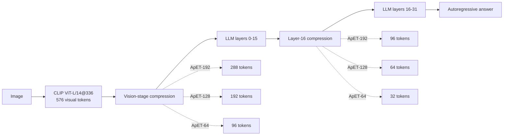
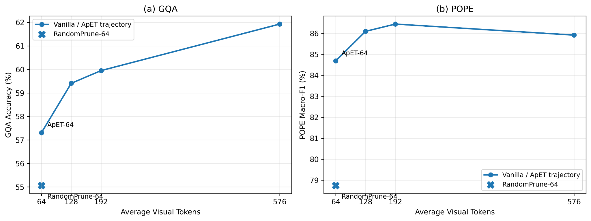
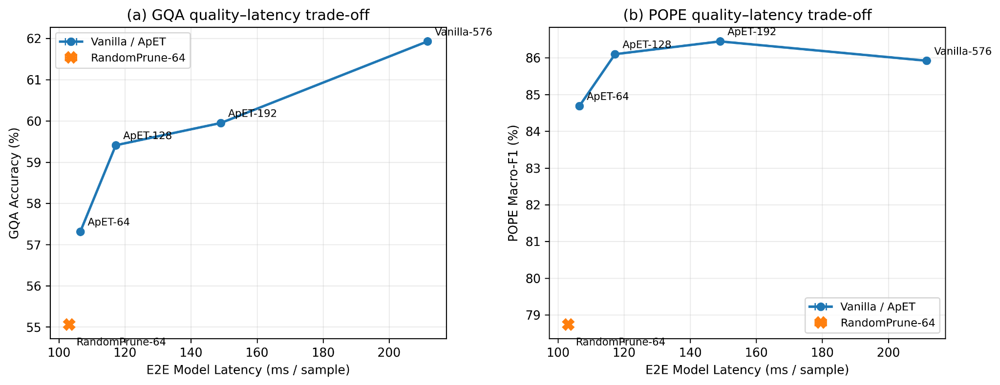
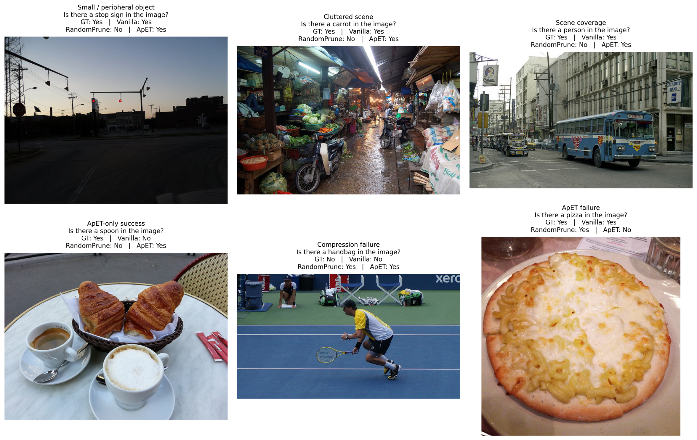

# ApET 视觉 Token 压缩复现与效率分析

> **非官方复现项目 / Reproduction & Analysis Project**  
> 基于 CVPR 2026 Highlight 论文 **ApET: Approximation-Error Guided Token Compression for Efficient VLMs** 及其官方代码完成。  
> 本项目的目标不是重新宣称 ApET 方法本身，而是完成 **LLaVA-1.5-7B 上的可复现实验、效率测量、matched-budget RandomPrune 对照，以及定量/定性分析**。

## 项目简介

视觉语言模型（VLM）通常会向 LLM 输入大量视觉 token。ApET 的核心思路是：不依赖 attention score，而是用 **线性重构误差（approximation error）** 衡量视觉 token 的信息量，再保留高误差、难以被其他 token 表示的视觉信息。

本项目围绕三个问题展开：

1. **能否复现 ApET 在 LLaVA-1.5-7B 上的 GQA / POPE 结果？**
2. **视觉 token 从 576 压缩到 192 / 128 / 64 后，真实推理延迟能降低多少？**
3. **如果只做最朴素的随机裁剪，在相同 token budget 下会怎样？ApET 的 token selection 是否真的有价值？**

### 一句话结论

在相同 **64 average visual tokens** 的强压缩预算下，ApET 相比我实现的 RandomPrune baseline：

- GQA：**+2.25** 个百分点
- POPE Macro-F1：**+5.95** 个百分点
- E2E model latency：只增加约 **3.3%**（103.10 ms → 106.48 ms）

这说明在相近的运行开销下，**“保留哪些 token”比“单纯减少 token 数”更重要**。

---

## 我完成的工作

这个项目不是只运行官方脚本。我在官方 ApET/LLaVA 代码基础上完成了以下工作：

- 在 **LLaVA-1.5-7B** 上复现 ApET 的 576 / 192 / 128 / 64 visual-token 配置；
- 完成 **GQA testdev-balanced（12,578）** 与 **POPE（8,910）** 的完整评估；
- 梳理并验证 ApET 的两阶段压缩位置：
  - vision encoder 输出后进行第一次压缩；
  - LLM **layer 16** 处进行第二次压缩；
- 增加固定随机种子，保证正式实验可重复；
- 实现独立 efficiency benchmark，测量：
  - E2E model latency；
  - LLM prefill latency；
  - throughput；
  - GPU memory；
- 对每个正式效率配置进行 **3 次独立重复实验**；
- 设计并实现一个 **matched-budget RandomPrune-64 baseline**：严格复用 ApET-64 的两阶段压缩位置与 token budget，在视觉编码器输出处将 576 个 visual tokens 随机保留为 96 个，并在 LLM 第 16 层进一步随机保留为 32 个；与 ApET 不同，RandomPrune 不使用 FPS、重构误差排序或 token merging，而是直接随机保留 token；
- 完成 quantitative trade-off、POPE case mining 与 success / failure qualitative analysis。

> **注意：** 本项目的 RandomPrune 与 ApET 论文 Table 5 中的 “Random” 不同。论文中的 Random 只是随机选择 ApET 的 basis tokens；本项目的 RandomPrune 是直接随机保留最终 visual tokens，用于构造更朴素的 matched-budget baseline。

---

## 方法理解：两阶段视觉 Token 压缩

LLaVA-1.5-7B 的 CLIP ViT-L/14@336 产生 **576 个视觉 token**。本项目复现的 ApET 在两个位置进行压缩：



因此论文中的 average token budget 对应：

| Setting | Vision stage | Layer 16 后 | Average visual tokens |
|---|---:|---:|---:|
| Vanilla | 576 | 576 | 576 |
| ApET-192 | 288 | 96 | 192 |
| ApET-128 | 192 | 64 | 128 |
| ApET-64 | 96 | 32 | 64 |

ApET 的核心步骤为：选择少量 basis tokens → 线性重构其他 token → 根据 approximation error 排序 → 保留高信息 token → 将被移除 token 合并到相似的保留 token。

---

## 1. 主结果：复现精度

### 与论文结果对照

| Setting | Paper GQA | Ours GQA | Δ | Paper POPE | Ours POPE | Δ |
|---|---:|---:|---:|---:|---:|---:|
| Vanilla-576 | 61.9 | **61.93** | +0.03 | 85.9 | **85.92** | +0.02 |
| ApET-192 | 60.2 | **59.95** | -0.25 | 86.3 | **86.45** | +0.15 |
| ApET-128 | 58.9 | **59.41** | +0.51 | 86.1 | **86.10** | ~0.00 |
| ApET-64 | 56.9 | **57.31** | +0.41 | 84.4 | **84.69** | +0.29 |

整体上，本地复现与论文报告结果高度接近。

---

## 2. Quality–Compression Trade-off



主要观察：

- GQA 随 token budget 减小总体下降；
- POPE 对中等程度压缩更鲁棒，ApET-192 的 POPE Macro-F1（86.45）甚至略高于 Vanilla（85.92）；
- 在最激进的 64-token budget 下，RandomPrune 的性能明显低于 ApET，说明 token selection / information preservation 对强压缩尤为重要。

---

## 3. 效率实验

### 测试协议

效率实验统一使用同一张 **NVIDIA GeForce RTX 3090 24GB**，并使用固定的 POPE 子集：

- 520 个固定样本，seed = 42；
- 前 20 个样本作为 warm-up；
- 后 500 个样本用于正式统计；
- 每个配置独立运行 **3 次**；
- 表中 `±` 为 3 次独立 run 的标准差。

**E2E Model Latency**：计时范围为模型侧 `model.generate()`，包含模型内部 multimodal preparation、vision encoder、token compression、LLM prefill 与 decoding；不包含外部图片磁盘 I/O 和计时前的 CPU 图像预处理。

**LLM Prefill Latency**：通过 hook 测量生成过程中的第一次 LLM forward，因此它是本项目定义的 **LLM prefill**，不假设与论文 Table 7 的 `Prefilling Time` 具有完全相同的 timer boundary。

### Controlled results

| Setting | Avg Tokens | GQA ↑ | POPE F1 ↑ | E2E Latency ↓ | Speedup ↑ | LLM Prefill ↓ | Throughput ↑ |
|---|---:|---:|---:|---:|---:|---:|---:|
| Vanilla-576 | 576 | 61.93 | 85.92 | 211.62 ± 0.21 ms | 1.000× | 155.10 ± 0.21 ms | 4.725/s |
| ApET-192 | 192 | 59.95 | **86.45** | 149.04 ± 0.38 ms | 1.420× | 90.62 ± 0.31 ms | 6.710/s |
| ApET-128 | 128 | 59.41 | 86.10 | 117.24 ± 0.50 ms | 1.805× | 58.80 ± 0.31 ms | 8.530/s |
| RandomPrune-64 | 64 | 55.06 | 78.74 | **103.10 ± 0.28 ms** | **2.053×** | **47.84 ± 0.17 ms** | **9.700/s** |
| ApET-64 | 64 | **57.31** | **84.69** | 106.48 ± 0.17 ms | 1.987× | 48.87 ± 0.10 ms | 9.391/s |

相较 Vanilla，ApET-64：

- visual token budget 减少 **88.9%**；
- E2E model latency 降低 **49.7%**；
- 获得约 **1.99×** E2E speedup；
- LLM prefill latency 降低 **68.5%**。

---

## 4. Quality–Latency Trade-off



最重要的 controlled comparison 是 **RandomPrune-64 vs ApET-64**。二者使用相同的 `96 → 32` token schedule，因此 LLM 的主要 token budget 是匹配的。

| Comparison | RandomPrune-64 | ApET-64 | ApET 相对变化 |
|---|---:|---:|---:|
| GQA | 55.06 | **57.31** | **+2.25 pp** |
| POPE Macro-F1 | 78.74 | **84.69** | **+5.95 pp** |
| E2E latency | **103.10 ms** | 106.48 ms | +3.38 ms / **+3.3%** |
| LLM prefill | **47.84 ms** | 48.87 ms | +1.02 ms / **+2.1%** |

这组结果说明：RandomPrune 的确更便宜，但 ApET 只付出了很小的额外运行时开销，就显著恢复了任务性能。

---

## 5. 定性分析



最终案例同时保留了 success 与 failure，避免只展示有利样本：

- **Small-object preservation**：stop sign 位于画面边缘且尺寸较小，RandomPrune 错误，而 ApET 保持正确；
- **Cluttered-scene preservation**：复杂市场场景下，ApET 能保持 carrot 判断；
- **Common-object preservation**：街景中 RandomPrune 丢失 person 判断，ApET 保持正确；
- **ApET-only success**：spoon 案例中 Vanilla 与 RandomPrune 均错误，而 ApET 正确；
- **Shared compression failure**：handbag 案例中两种压缩方法均产生错误；
- **ApET-specific failure**：pizza 是显著大目标，但 ApET-64 仍错误，而 Vanilla 与 RandomPrune 正确，说明强压缩下 ApET 并非总能保留任务关键证据。

进一步的 case-pattern 统计显示：在 **710 个 Vanilla 正确但 RandomPrune 错误**的 POPE 样本中，ApET 在其中 **564 个（79.4%）**仍保持正确预测。这个统计只作为 case-pattern observation，不作为新的官方 benchmark metric。

---

## 6. 与文献结果的简要参考

下面数字来自 **ApET 论文 Table 1**，本项目没有在本地环境重新复现这些方法，因此它们仅用于文献层面的参考，**不与本项目 controlled experiments 混为一谈**。

| Method | Avg Tokens | GQA | POPE |
|---|---:|---:|---:|
| ToMe | 64 | 48.6 | 52.5 |
| FastV | 64 | 46.1 | 48.0 |
| SparseVLM | 64 | 52.7 | 75.1 |
| PDrop | 64 | 47.5 | 55.9 |
| VisionZip | 64 | 55.1 | 77.0 |
| ApET | 64 | 56.9 | 84.4 |

一个值得注意的现象是：本项目的 RandomPrune-64 在 GQA / POPE 上能够接近甚至超过部分文献报告方法。但这里**不能据此宣称 RandomPrune 优于这些方法**，因为不同方法的层间压缩位置、token schedule、实现细节与运行环境并不完全一致。真正严格可控的比较仅限于本项目中的 **RandomPrune-64 vs ApET-64**。

---

## 7. 实验环境

| Component | Configuration |
|---|---|
| Model | LLaVA-1.5-7B |
| Vision encoder | CLIP ViT-L/14@336 |
| GPU | NVIDIA GeForce RTX 3090 24GB |
| Python | 3.10.18 |
| PyTorch | 2.1.2 |
| torchvision | 0.16.2 |
| Transformers | 4.37.2 |
| CUDA runtime used by PyTorch | CUDA 12.1 build |
| NVIDIA driver | 550.163.01 |
| Driver-reported CUDA capability | 12.4 |
| Seed | 42 |
| Conversation template | `vicuna_v1` |
| Basis token number | 10 |

---

## 8. 项目代码结构

以下是本项目相对于官方代码重点新增/修改的部分：

```text
llava/
├── eval/model_vqa_loader.py          # seed + compression method switch
└── model/
    ├── llava_arch.py                 # vision-stage RandomPrune baseline
    └── modeling_llama_x.py           # layer-16 RandomPrune baseline

experiments/apet_llava15/
├── metrics/                          # final CSV results
├── figures/                          # quantitative / qualitative figures
├── cases/pope/                       # case mining results
└── tools/
    ├── benchmark_efficiency.py       # latency / prefill / throughput benchmark
    ├── aggregate_efficiency.py       # ApET 3-run aggregation
    ├── aggregate_randomprune_efficiency.py
    ├── build_pope_qual_cases.py
    └── plot_*.py
```

为了保持 README 的展示性，这里不展开全部运行命令；完整实验逻辑与参数均保留在 `experiments/apet_llava15/tools/` 和官方 `scripts/llava1_5/` 中。

---

## 9. 我从这个项目中完成的工程闭环

这个复现项目覆盖了一次较完整的 VLM inference research workflow：

- 阅读并追踪 LLaVA 的 multimodal input → vision encoder → projector → LLM generation 代码路径；
- 在 vision encoder 输出和 LLM 中间层操作 visual-token sequence；
- 理解并复现 training-free token compression；
- 构建固定数据子集和可重复 seed protocol；
- 使用 CUDA event / model hook 进行 latency 与 LLM-prefill profiling；
- 设计 matched-budget baseline，而不是只比较不同 token 数；
- 对实验进行 3-run 重复并区分 sample-level variability 与 run-level variability；
- 完成 benchmark evaluation、自动汇总、trade-off visualization 与 qualitative failure analysis。

---

## 10. 局限性

- 当前只完整复现了 **LLaVA-1.5-7B + GQA / POPE**，没有复现论文中的全部模型与 benchmark；
- ToMe、FastV、SparseVLM、PDrop、VisionZip 等结果仅引用论文报告值，未在本地重新运行；
- 本项目使用 RTX 3090，而论文效率实验使用 A100，因此**绝对时间不能与论文 Table 7 直接比较**；
- 本项目的 `LLM Prefill Latency` 有明确的本地计时边界，不假设等同于论文未公开具体 timer boundary 的 `Prefilling Time`；
- 没有重新实现 TFLOPs profiling；
- End-to-end peak GPU memory 在当前单样本 LLaVA-7B 设置下约为 15.0 GB，各 token budget 差异很小，因此没有把显存作为主要结论；
- RandomPrune 是本项目自行设计的 naïve baseline，并不是 ApET 论文中的 Random-basis ablation。

---

## 致谢与引用

本项目基于 ApET 官方开源代码进行学习、复现与实验扩展：

- Original project: **Maqkccx/ApET**  
  https://github.com/Maqkccx/ApET
- Paper: **ApET: Approximation-Error Guided Token Compression for Efficient VLMs**, CVPR 2026 Highlight

如果使用原作者的方法或代码，请引用原论文：

```bibtex
@article{ma2026apet,
  title={ApET: Approximation-Error Guided Token Compression for Efficient VLMs},
  author={Ma, Qiankun and Zhang, Ziyao and Wang, Haofei and Chen, Jie and Song, Zhen and Zheng, Hairong},
  journal={arXiv preprint arXiv:2602.19870},
  year={2026}
}
```

本仓库应明确标注为 **reproduction / analysis project**，不应描述为 ApET 的官方实现，也不应将 ApET 原方法作为本项目原创贡献。

---

## 项目总结

本项目成功复现了 ApET 在 LLaVA-1.5-7B 上的主要 GQA / POPE 结果，并进一步建立了真实 latency benchmark 与 matched-budget RandomPrune baseline。实验表明，在 88.9% 的视觉 token 压缩下，ApET-64 将 E2E model latency 减少约 49.7%，同时在与 RandomPrune-64 几乎相同的运行开销下显著保留更多任务性能。这个结果把“压缩率、任务质量、真实延迟”放在同一个受控实验框架下进行分析，也验证了 information-aware token selection 相对于 naïve pruning 的实际价值。
